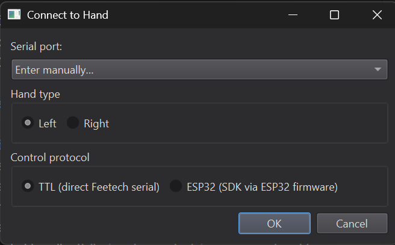
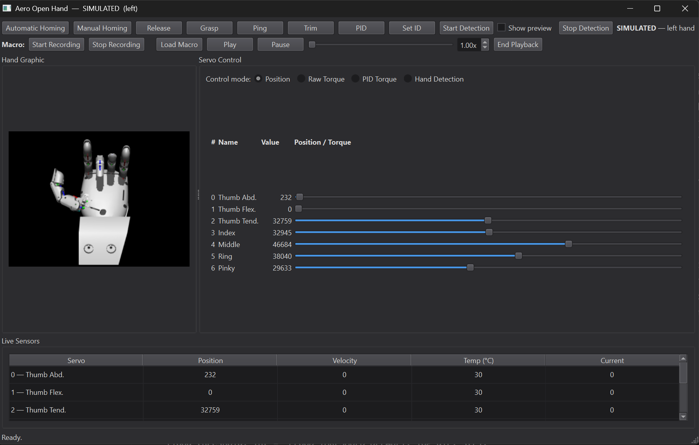

# Aero Hand Open Controller

The [Aero Hand Open](https://tetheria.github.io/aero-hand-open/) is a low cost, anthropomorphic robotic hand. Their control setup is a Xiao esp32s3 soldered to a control board that connects to the seven Feetech HLS3606M servo motors. The esp32s3 only connects to the serial pins of the control board, as the control board simply exposes a serial interface to the daisy chained servo motors which are TTL servo motors.

This project is a monorepo containing all code I have used to control the hand, all wrapped up in a feature-rich GUI.

| | |
|---|---|
|  |  |

## Feature descriptions

- **Hardware interfacing**: The hand.py is an abstract class that presents a collection of control methods. It has 2 implementations: the "ttl" implementation expects the serial port to be directly connected to the serial bus (ie. no ESP32 middleman), and the "sdk" implementation expects the serial port to be connected to the ESP32 with the [Aero Hand Open Firmware](https://github.com/TetherIA/aero-hand-open/tree/main/firmware/main) programmed on it and uses the SDK from TetherIA.
- **Manual control**: This project has a CLI and GUI under apps/ for no-code control of the hand, using raw position commands, raw speed commands, or PID using torque control (not tested). In addition, the GUI has a grasp button that moves all joints to their grasped position at a configurable speed and automatically stops at a configurable current draw.
   - Setting servo IDs and automatic homing are also available, to keep consistency with the [original GUI](https://github.com/TetherIA/aero-hand-open/blob/main/sdk/src/aero_open_sdk/gui.py)
   - In addition, since I have broken the hand multiple times using the automatic homing, there is a manual homing option that guides the user through the homing routine and moves more carefully.
   - PID torque control allows individual gains for each finger, and all gains are adjustable during runtime for convenience.  
   - *Note: the CLI is broken as of the time of this writing (3/17), it just needs to be refactored to present the user a choice on startup of which hardware setup to use*
- **Sensor panel**: Both the GUI and CLI have a sensor update thread that reads position, current draw and temperature data from the servos in real time.
- **Real Hand control**: Using the [Google Mediapipe hand landmark model](https://github.com/google-ai-edge/mediapipe-samples/blob/main/examples/hand_landmarker/python/hand_landmarker.ipynb), the user can control the hand with their actual hand using their webcam. This feature is only available in the GUI at the time of this writing (3/17)
- **Macro recording**: Hand movements, either manually controlled or controlled with an actual hand, can be recorded and played back within the GUI.
- **3d hand visualization**: All hand joint positions are reflected in the GUI using the STL models in [aero-open-sim](https://github.com/TetherIA/aero-open-sim/tree/main/mujoco).
- **Digital twin simulation**: If a real hand is not available, you can use a simulated hand to test new code for logic issues.
- **Serial communication logging**: Real hand and simulated hand serial port activity is logged, and logs can be analyzed to assess bus issues using tools/sim_log_analyze.py.

## Installation

1. (Optional but recommended) Create a virtual environment using python 3.11 using any virtual env manager. I use Anaconda to manage environments.
2. Clone the repository. 
`git clone https://github.com/snapwhiz914/aero-open-hand-controller`
3. In the repository root directory, run: 
`pip install -e.` 
to install all packages.

## Usage

- Running the GUI: `python apps/gui.py`
- Running the CLI: `python apps/cli.py`

## Contributing

I used Claude to generate the significant majority of this codebase. There is a CLAUDE.md file in the main directory that other contributors can use for their own Claude agents. However, if you are going to make a PR with Claude, please test it and review it yourself before pushing.

## Docs

Claude generated docs exist in /docs.
- feetech_protocol.md: a writeup I had Claude generate to use to create a plan to write the Python version of the Feetech servo protocol API.
- TUNING.md: Instructions for tuning the Hand Detector parameters.

## TODO/Roadmap
- Expand the testing suite to cover all features. Currently only macros and the low level servo protocol have tests.
- Make the hand detection more accurate using one or more of the following methods:
   - Using a depth camera to calculate thumb abduction.
   - Using a pre-trained model that was trained on a depth camera input for hand detection. I haven't been able to find any but I didn't look very hard.
- Make the macro playback less choppy. It works, but it would be nicer if it were smoother.
- Make the digital twin more realistic by calculating required torque for an action and reporting that torque over the virtual sensors